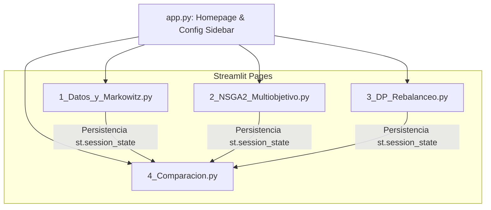

# 📈 Sistema de Optimización de Portafolio con GA y DP

**Institución:** Universidad Nacional Mayor de San Marcos (UNMSM)  
**Facultad:** Facultad de Ingeniería de Sistemas e Informática (FISI)  
**Escuela Profesional:** Escuela Profesional de Ingeniería de Software  
**Curso:** Análisis y Diseño de Algoritmos (ADA) — Ciclo 2026-1  
**Docente:** Prof. Mg. Ing. Ernesto D. Cancho-Rodríguez, MBA  

---

## 👥 Equipo de Desarrollo
* **Jorge Luis Junior Galvez Garro**
*

---

## 📌 Descripción General del Proyecto

Este proyecto integrador consolida los algoritmos de optimización de portafolios desarrollados a lo largo del curso de **Análisis y Diseño de Algoritmos (ADA)**. El sistema integra múltiples enfoques cuantitativos (clásicos, heurísticos y de programación dinámica) para la toma de decisiones financieras sobre activos mineros con operaciones en el Perú, utilizando datos reales de Yahoo Finance.

El proyecto está construido como una aplicación web interactiva y multimodular en **Streamlit** y está diseñado para ser desplegado en **Streamlit Community Cloud**, facilitando la interacción con gráficos dinámicos y la exportación de resultados.

---

## 📚 Conexión con los Temas de ADA (Temas 9 al 13)

El sistema integra y aplica de forma directa los siguientes temas fundamentales del curso:

1. **Tema 9 (Greedy & GRASP):** Algoritmos voraces (G2I y R2I) para construir portafolios base (superados por los métodos de este proyecto).
2. **Tema 10 (Programación Dinámica - DP):** Implementación de **Backward Induction de Bellman** en el Módulo 3 para decidir el rebalanceo secuencial óptimo de activos considerando costos de transacción.
3. **Tema 11 (Branch & Bound - B&B):** Enfoque complementario para la selección de portafolios con restricciones de cardinalidad (reforzado por el algoritmo genético).
4. **Temas 12 y 13 (Algoritmos Genéticos - GA):** Implementación del algoritmo multiobjetivo **NSGA-II** en el Módulo 2 para generar la frontera Pareto óptima (Max. Retorno vs. Min. Riesgo).
5. **Modelo de Markowitz:** Enfoque analítico clásica de Media-Varianza optimizada con programación no lineal (`scipy.optimize.minimize` vía SLSQP) en el Módulo 1.

---

## ⚙️ Parámetros por Defecto y Sidebar Global

El sistema cuenta con una barra lateral (`st.sidebar`) interactiva visible en todas las páginas que permite configurar de manera global las variables del análisis:

* **Activos (Tickers):** `FSM`, `VOLCABC1.LM`, `ABX.TO`, `BVN`, `BHP` (mineras con operaciones en Perú).
* **Fecha de Inicio:** `2015-01-01`
* **Fecha de Fin:** `2024-12-31`
* **Capital Inicial:** USD `$100,000`
* **Frecuencia de Rebalanceo:** Semanal, Mensual (por defecto) o Trimestral.
* **NSGA-II (Parámetros):** Población ($MU$: 100, rango 50-300) y Generaciones ($NGEN$: 80, rango 30-200).
* **DP (Parámetros):** Costo de transacción ($\lambda_{TC}$: 0.001, rango 0.0001-0.01) y Horizonte ($T$: 12 periodos, rango 4-52).

---

## 🏗️ Arquitectura y Estructura del Proyecto

El proyecto sigue una estructura limpia para el enrutamiento multipágina de Streamlit:

```text
portfolio_optimizer/
├── app.py                             # Homepage y sidebar de configuración
├── pages/
│   ├── 1_Datos_y_Markowitz.py         # Módulo 1: Descarga y Frontera de Markowitz
│   ├── 2_NSGA2_Multiobjetivo.py       # Módulo 2: Algoritmo Genético NSGA-II (DEAP)
│   ├── 3_DP_Rebalanceo.py             # Módulo 3: Programación Dinámica (Backward Induction)
│   └── 4_Comparacion.py               # Módulo 4: Comparación Cruzada y Métricas
├── requirements.txt                   # Archivo de dependencias del sistema
└── README.md                          # Documentación del proyecto
```



---

## 🖥️ Módulos e Interfaz Obligatoria

### 1. Módulo 1 — Datos y Markowitz
* **Propósito:** Descargar precios históricos de Yahoo Finance, calcular retornos logarítmicos, la rentabilidad esperada anualizada ($\mu$) y la matriz de covarianza ($\Sigma$), resolviendo la optimización mediante `scipy.optimize`.
* **Componentes obligatorios:**
  * Gráfico de la **Frontera Eficiente de Markowitz** (scatter plot con acciones individuales, curva eficiente, portafolio de máximo Sharpe y portafolio de mínima varianza).
  * Gráfico de tarta (Pie Chart) con la composición del portafolio óptimo (máximo Sharpe).
  * Tarjetas métricas (`st.metric`) de Sharpe Ratio, Sortino Ratio y volatilidad del portafolio.
  * Simulación de evolución de riqueza comparando **Buy & Hold** frente a **Markowitz Rebalanceado**.
  * Botón de descarga (`st.download_button`) para exportar los pesos óptimos a un archivo Excel (.xlsx).

### 2. Módulo 2 — NSGA-II Multiobjetivo
* **Propósito:** Implementar la optimización bi-objetivo (retorno vs. riesgo) mediante el algoritmo evolutivo **NSGA-II** utilizando la librería `DEAP`.
* **Componentes obligatorios:**
  * Configuración de la población ($MU$) y generaciones ($NGEN$) mediante sliders en la página.
  * Barra de progreso (`st.progress`) durante la evolución.
  * Gráfico del Frente de Pareto interactivo con Plotly, superpuesto con la frontera de Markowitz y coloreado por Sharpe Ratio.
  * Análisis de 3 portafolios representativos del frente: Conservador, Agresivo y Máximo Sharpe (con sus respectivos Pie Charts).
  * Gráfico de convergencia del **Hypervolume** a lo largo de las generaciones.
  * Simulación de riqueza del portafolio GA vs. Buy & Hold.
  * Botón de descarga para exportar el frente Pareto y los 3 portafolios a Excel.

### 3. Módulo 3 — DP Rebalanceo
* **Propósito:** Modelar el problema de rebalanceo dinámico de activos mediante **Programación Dinámica** (ecuación de Bellman por inducción hacia atrás), buscando equilibrar el costo de transacción y el rendimiento.
* **Componentes obligatorios:**
  * Configuración interactiva de costos de transacción ($\lambda_{TC}$), número de periodos ($T$) y paso de la grilla de discretización de pesos.
  * Simulación y gráfico de evolución de riqueza para 3 estrategias: **Buy & Hold**, **DP Optimizado** y **Siempre Rebalanceado**.
  * Heatmap de la tabla de programación dinámica (costos óptimos acumulados por estado y periodo).
  * Timeline o gráfico de eventos mostrando los periodos exactos donde se ejecutó un rebalanceo bajo la política DP.
  * Tarjetas métricas (`st.metric`) mostrando riqueza final, costos acumulados y Sharpe de cada estrategia.
  * Botón de descarga de los datos de la simulación a Excel.

### 4. Módulo 4 — Comparación Cruzada
* **Propósito:** Integrar y contrastar de manera unificada los resultados obtenidos por los tres enfoques de optimización.
* **Componentes obligatorios:**
  * Gráfico de barras comparativo de métricas clave (Sharpe Ratio, Riqueza final, Max Drawdown) para todos los métodos.
  * Gráfico interactivo y superpuesto de evolución de riqueza de **todos los métodos en una sola vista**.
  * Tabla resumen interactiva (`st.dataframe`) de métricas financieras.
  * Ranking automático de los mejores métodos según Sharpe Ratio y Riqueza final.
  * Botón de descarga del reporte consolidado en Excel con múltiples hojas (una pestaña por cada método).

---

## 🚀 Instrucciones de Despliegue en Streamlit Community Cloud

Para desplegar la aplicación de forma gratuita:

1. **Crear un repositorio público en GitHub** con la estructura descrita en la sección de arquitectura.
2. **Subir los archivos del proyecto** al repositorio, asegurando incluir:
   * `app.py`
   * Carpeta `pages/` con los 4 archivos correspondientes.
   * `requirements.txt`
   * `README.md`
3. Ingresar a [Streamlit Community Cloud](https://share.streamlit.io/) e iniciar sesión con la cuenta de GitHub.
4. Seleccionar la opción **"Create app"**, elegir el repositorio, la rama (`main`) y establecer el archivo principal como `app.py`.
5. Presionar **"Deploy!"**. Streamlit instalará las dependencias y compilará la aplicación.
6. Copiar la URL pública asignada (ej. `https://[proyecto].streamlit.app/`) para su entrega.

---

## 📂 Entregables del Proyecto

### 1. Estructura en Google Drive (`EqX.W14 Proyecto Optimizacion GA DP/`)
```text
EqX.W14 Proyecto Optimizacion GA DP/
├── Informe_Proyecto_W14.docx
├── notebooks/
│   ├── Modulo1_Datos_Markowitz.ipynb
│   ├── Modulo2_NSGA2_Multiobjetivo.ipynb
│   ├── Modulo3_DP_Rebalanceo.ipynb
│   └── Modulo4_Comparacion.ipynb
├── streamlit/
│   ├── app.py
│   ├── pages/ (4 archivos .py)
│   └── requirements.txt
├── diagramas/
│   ├── componentes.wsd
│   └── componentes.png
└── URL_sistema_desplegado.txt
└── Link_a_Video_Expo_Demo_sistema_desplegado_YT.txt
```

### 2. Estructura del Informe Final (.docx)
1. **Carátula:** Datos institucionales, título del proyecto, integrantes, fecha y enlaces públicos (GitHub y URL de Streamlit).
2. **Introducción:** Descripción detallada del sistema, objetivos y conexión académica con el curso.
3. **Descripción de Módulos:** Detalle técnico de cada componente, algoritmos que implementa y capturas de pantalla de la interfaz de Streamlit.
4. **Proceso de uso de IA:** Registro obligatorio del uso de herramientas generativas (Claude, ChatGPT, Gemini, etc.), indicando prompts aplicados, respuestas y modificaciones manuales de código.
5. **Resultados:** Comparativa financiera de los métodos, capturas del sistema en funcionamiento y métricas.
6. **Diagrama de Componentes UML:** Modelado UML del sistema (PlantUML con protocolo BATD), insertado como imagen con explicación técnica.
7. **Conclusiones:** Respuestas detalladas a preguntas clave de optimización (¿qué método optimizó mejor? ¿el rebalanceo justifica los costos? ¿GA supera a Markowitz?).
8. **Referencias:** Bibliografía en formato estándar (papers de Markowitz, NSGA-II, DP de Vaezi et al., etc.).

---

## 📊 Criterios de Evaluación

| # | Criterio | Peso | Descripción |
|---|---|---|---|
| 1 | **Notebooks en Colab** | 15% | Los 4 notebooks adjuntos deben ejecutarse de inicio a fin sin errores, mostrando métricas y visualizaciones correctas. |
| 2 | **Sistema Streamlit Funcional** | 30% | Los 4 módulos deben estar perfectamente adaptados a Streamlit, con controles interactivos estables y botones de descarga a Excel activos. |
| 3 | **Despliegue en Cloud** | 15% | URL de despliegue en Streamlit Community Cloud accesible y configurada correctamente con su `requirements.txt`. |
| 4 | **Módulo de Comparación Cruzada** | 15% | Visualización interactiva que integre todos los métodos en una vista de riqueza histórica y ranking financiero automático. |
| 5 | **Informe Escrito + UML** | 15% | Presentación del documento con el detalle de módulos, registro de uso de IA y el Diagrama de Componentes UML explicado. |
| 6 | **Video Explicativo** | 10% | Exposición pregrabada que demuestre el funcionamiento de la aplicación web y brinde una breve explicación del código fuente. |
